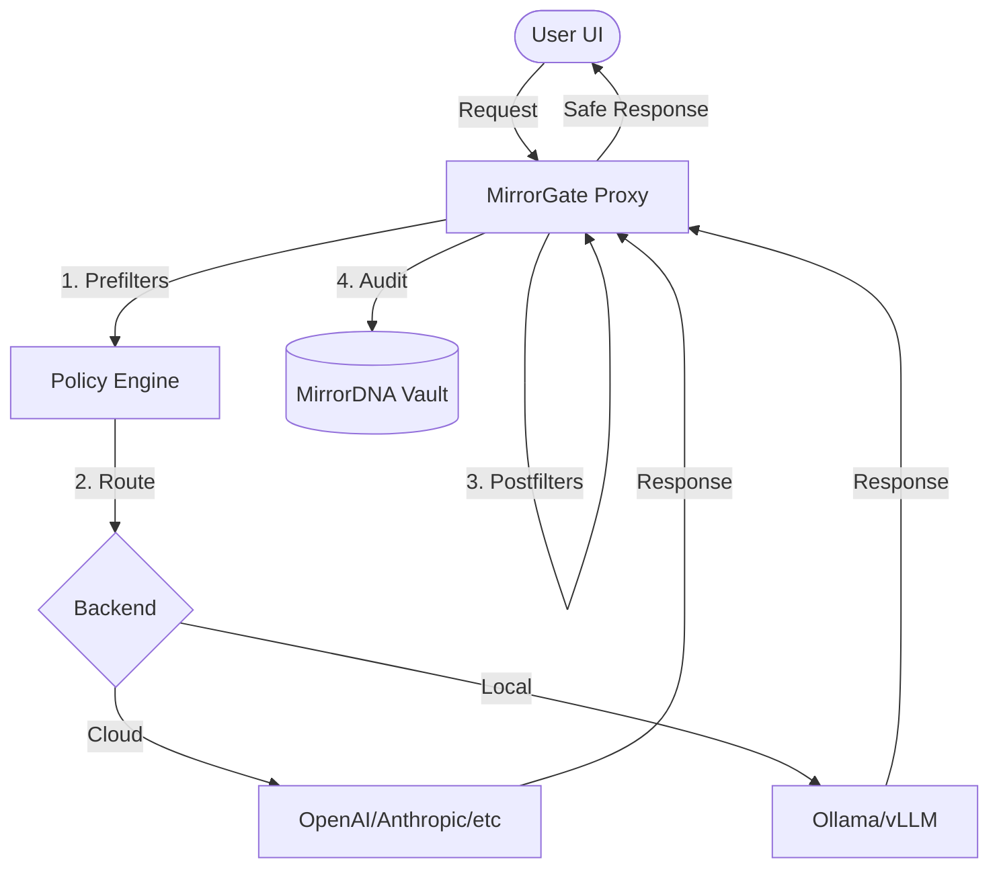

# ⟡ MirrorGate

**Sovereign Inference Control Plane for Reflective AI.**

MirrorGate is a policy-driven proxy that enforces the [MirrorDNA Standard](https://activemirror.ai) across all AI interactions. It turns raw LLM outputs into governed *reflection engines*, ensuring deterministic safety, privacy, and epistemic humility.

---

## 🔍 What is MirrorGate?

MirrorGate acts as a security and policy layer between your application (client) and inference backends (Cloud, Local, or Hybrid). It is **not** a model; it is the **control plane** that defines how models are allowed to behave.

- **Policy-Driven**: Enforces execution flows (prefilters/postfilters) defined in data, not just code.
- **Model-Agnostic**: Works with any backend (OpenAI, Anthropic, Ollama, vLLM).
- **Deterministic**: Outcomes are governed by a signed, versioned safety contract.
- **Fail-Closed**: If safety cannot be guaranteed, the gate remains shut.

---

## 🏗 Architecture



---

## 📂 Repository Structure

- `spec/`: Protocol definitions, schemas, and policy profiles.
- `src/`: The reference implementation runtime.
- `docs/`: In-depth architecture, governance, and user guides.
- `examples/`: Ready-to-use proxy implementations for Node.js and Python.
- `tests/`: Comprehensive safety and regression suites.

---

## 🚀 Getting Started

1. **Clone the Repo**:
   ```bash
   git clone https://github.com/MirrorDNA-Reflection-Protocol/MirrorGate.git
   ```
2. **Configure Environment**:
   ```bash
   cp .env.example .env
   # Edit .env with your backend API keys
   ```
3. **Run the Reference Proxy**:
   ```bash
   cd src/server
   npm install && npm start
   ```

---

## 🛡 Security & Trust

MirrorGate is built on the principle of **Inference Safety as a Protocol**. 

Refer to [spec/safety_contract.md](spec/safety_contract.md) for details on:
- Auth & Identity verification.
- HMAC signatures for secure routing.
- Mandatory reflection tokens (glyphs).

---

## 📜 License

MirrorGate is released under the **MIT License**. Part of the MirrorDNA ecosystem.

Copyright © 2026 Active MirrorOS.
